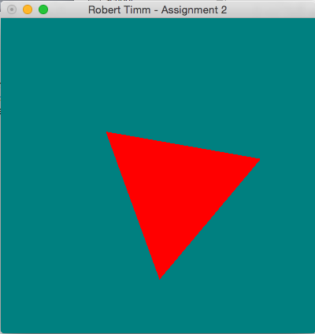
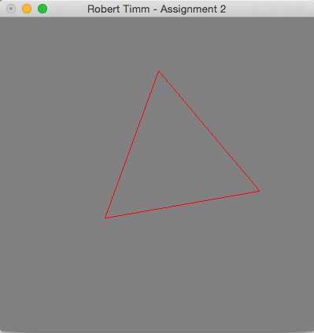

## CSCE-441-Project-2 OpenGL Callbacks

### Compile & Run
* Navigate to this repo after cloning it locally to your device
* Type `make`
* Run with `./main`

### Guidelines
* Make the polygon spin when the left mouse button is pressed down, but spin in the opposite direction when the right button is pressed down.
* Make motion stop when the left/right mouse button is released, rather than when a different button is pressed.
* While a button is pressed down (and the polygon is spinning), you should let the user control the speed of the rectangle.  Here is how the control should work (assume the point at which they first click down on the mouse button is the “home” position):  Moving the mouse up from the home position should make it go faster, moving it down from the home position should make it go slower.  You can always start spinning at some default rate (i.e. that is the rate it will spin at whenever the mouse is in the home position), if you want.  The farther up the mouse is moved from the home position, the faster it should spin, and the farther below, the slower.  This should apply only while the button is pressed – after releasing the button, the speed should be “forgotten”, so the starting spinning speed should be the same each time the button is pressed.
* Moving the mouse left of the home position should decrease the intensity of the background color.  Moving the mouse to the right of the home position should increase the intensity of the color.  Whenever the mouse is at the home position, it should be at the initial color.  Note that this also needs to occur only while a mouse button is depressed.
* Change the color of the background to cyan, magenta, yellow, or white, when the ‘c’, ‘m’, ‘y’, or ‘w’ key is hit, respectively.  Note that the mouse movement should be able to increase/decrease the background color, so make sure the starting background color is not “pure” cyan/magenta/yellow/white, but can vary.  Pick a color for your polygon that can be seen regardless of background color.
* The user should be able to toggle between the way the polygon is displayed.  If the user hits the “1” key, the polygon should be displayed as a set of points marking the vertices only.  If the user hits the “2” key, the polygon should be displayed as a set of lines showing the outline of the polygon only (i.e. not filled in).  If the user hits the “3” key, the polygon should be filled in completely.  You can start in a default position, and should always display the polygon in the form of the last way selected.
* When the user presses the middle mouse button, they should be able to pick up and drag the polygon in the window.  That is, when the user presses the middle mouse button (anywhere in the window, it does not need to be in the polygon itself), holds the mouse button down, moves the mouse, and releases the button, the polygon should “drag” by the distance/direction that the mouse moved.  Note that when you start spinning the polygon, it is OK for the polygon to spin around the center of the screen, rather than its own center

## Screenshots

